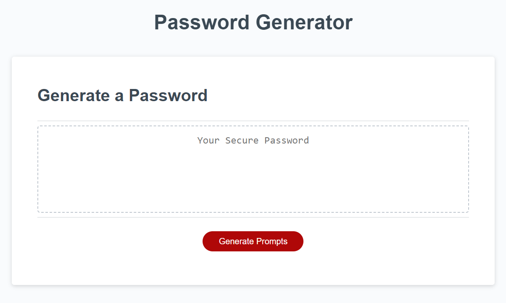

# JavaScript-Password-Generator

## Description

This is the 'Module 03' challenge assignment for the UCF coding bootcamp.

We were tasked with creating a password generator, giving us experience with using JavaScript in an applicable way.

## Installation

1. Copy the SSH URL
2. Open a terminal, navigate to the path where you want to open the code, and then enter into the terminal 'git clone [ssh url]'
3. ?
4. Profit

## Usage

You can install Visual Studio Code and get the 'Live Server' extension if you want to test it out in a web browser, otherwise you can just follow this [link](https://binnyboy1.github.io/Advanced-CSS-Portfolio/).

Clicking on 'Generate Prompts' will prompt you with criteria questions for the password you want. After answering the prompts, you will be given a password. A button will also appear, allowing you to refresh the password as many times as you like.